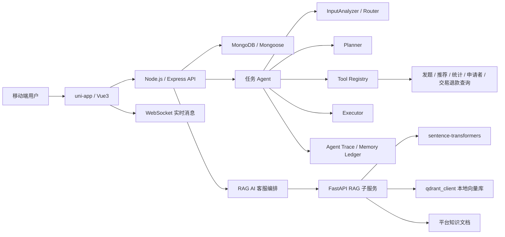

# MyQA 问答任务服务平台 / RAG AI 客服 / 任务 Agent

MyQA 是一个面向移动端的问答任务服务平台。基础业务支持用户发布问题、申请回答、实时沟通、评价退款和个人任务管理；在业务平台之上接入了两类 AI 能力：

- **RAG AI 客服**：面向平台规则、退款、交易状态等问题，结合知识库检索和实时业务上下文生成客服回复。
- **任务 Agent**：用户可以用自然语言完成平台任务，例如发布问题、查问题推荐、查发题统计、查申请者、查交易/退款状态等。

当前项目已完成本地前后端、RAG 子服务和任务 Agent 的联调验证，适合作为 AI 应用开发、大模型应用开发、Agent 工程化实践项目阅读。

## 项目亮点

- **完整业务闭环**：覆盖 25 个 uni-app 页面、10 个 Express 路由、14 个 Mongoose 数据模型，包含发题、申请回答、聊天、评价、退款、个人中心、AI 客服和 Agent 工作台等核心流程。
- **RAG AI 客服**：内置 4 类平台知识文档，使用 `sentence-transformers` 做文本向量化，使用 `qdrant_client(path=...)` 构建本地向量库，并结合 MongoDB 中的交易、退款、问题状态和聊天记录组织 LLM 输入。
- **任务 Agent 架构**：拆分 12 个 Agent 模块，包含输入分析、请求路由、Planner、Tool Registry、Executor、Evaluator、Final Summarizer、Memory 和 Trace。
- **可观测执行轨迹**：Agent 执行过程会保存计划、工具调用、Observation、结果卡片、Memory Ledger 和 Agent Trace，前端可查看历史轨迹。
- **安全执行约束**：写操作前做参数补全和二次确认，平台工具通过 Tool Registry 白名单注册，工具失败或结果为空时使用 ReAct 条件放宽或澄清追问。

## 技术栈

| 层级 | 技术 |
| --- | --- |
| 移动端 | uni-app、Vue3、Vue SFC、uni-ui |
| 后端接口 | Node.js、Express、RESTful API、JWT、WebSocket |
| 数据层 | MongoDB、Mongoose、本地 Qdrant 向量库 |
| AI 服务 | FastAPI、sentence-transformers、LLM API、RAG、Agent、ReAct |
| 工程能力 | 鉴权、权限控制、工具白名单、安全确认、Trace 可观测性、错误兜底 |

## 系统架构



## Agent 执行流程

MyQA Agent 不是简单的聊天机器人，而是一个带请求分流和工具执行约束的任务执行器。

```text
用户输入
  -> AgentInputAnalyzer：一次模型调用同时输出 memoryPatch 和 route
  -> Request Router：判断 chat / memory_only / task / clarification
  -> chat：直接回复
  -> memory_only：保存偏好后回复
  -> clarification：信息不足时先追问
  -> task：Planner 生成 toolSteps
           -> Executor 调用 Tool Registry
           -> Observation 保存工具结果
           -> Evaluator 判断结果是否足够
           -> 必要时进行 ReAct 条件放宽或澄清追问
           -> Final Summarizer 基于真实工具结果生成答案
  -> 保存 AgentTrace 和 Memory Ledger
  -> 前端展示计划、工具调用、结果卡片和历史轨迹
```

核心设计约束：

- 普通聊天、偏好记忆和待澄清请求不会进入完整工具链。
- Planner 只负责选择可执行工具步骤，不直接编造最终结果。
- Tool Registry 统一做工具白名单、参数校验和工具调用。
- Final Summarizer 必须基于真实工具结果总结，避免凭空生成执行结论。
- 转人工、发布问题等高影响操作会先生成确认卡片，用户确认后再执行。

## RAG AI 客服设计

RAG AI 客服用于回答平台规则、退款、交易状态、问题状态等业务问题。

处理链路：

```text
用户客服消息
  -> Node 后端读取用户身份、交易、退款、问题状态、最近聊天
  -> FastAPI RAG 子服务检索平台知识文档
  -> Node 后端组合「知识片段 + 实时业务上下文」
  -> LLM 生成结构化客服回复
  -> 置信度不足或明确要求人工时，引导转人工客服
```

知识库目录：

```text
uni-qa(back)/docs/ai-knowledge/
```

当前内置文档：

- `platform-rules.md`
- `refund-policy.md`
- `adoption-flow.md`
- `customer-service-faq.md`

## 目录结构

```text
.
├── uni-qa(front)/                 # uni-app + Vue3 移动端
│   ├── src/pages/                 # 页面：首页、发题、聊天、Agent、客服、个人中心等
│   ├── src/api/                   # 前端 API 封装
│   ├── src/components/            # 全局组件
│   └── src/pages.json             # uni-app 页面配置
│
├── uni-qa(back)/                  # Node.js / Express 后端
│   ├── src/routes/                # REST API 路由
│   ├── src/models/                # Mongoose 数据模型
│   ├── src/agent/                 # Agent 编排、路由、记忆、工具、Trace
│   ├── src/ai/                    # AI 客服编排、RAG 客户端、LLM 客户端
│   ├── src/services/socket.js     # WebSocket 实时消息
│   ├── docs/ai-knowledge/         # RAG 知识库文档
│   └── rag_py/                    # FastAPI RAG 子服务
│
└── README.md
```

## 本地运行

### 1. 准备环境

建议环境：

- Node.js 18+
- Python 3.10+
- MongoDB 6+
- 可用的 OpenAI 兼容 LLM API 网关

### 2. 启动后端 API

```powershell
cd "uni-qa(back)"
npm install
copy .env.example .env
npm run dev
```

后端默认监听：

```text
http://localhost:3000
```

关键环境变量：

```env
DBHOST=127.0.0.1
DBPORT=27017
DBNAME=myqa
JWT_SECRET=your_jwt_secret

AI_BASE_URL=https://your-gateway.example.com/v1
AI_API_KEY=your_api_key
AI_MODEL=your_model

RAG_SERVICE_URL=http://127.0.0.1:8001
```

### 3. 启动 RAG 子服务

```powershell
cd "uni-qa(back)\rag_py"
python -m venv .venv
.\.venv\Scripts\activate
pip install -r requirements.txt
copy .env.example .env
uvicorn app:app --host 127.0.0.1 --port 8001 --reload
```

RAG 子服务默认接口：

```text
GET  /health
POST /index
POST /search
```

初始化或重建知识库索引：

```powershell
Invoke-RestMethod `
  -Method Post `
  -Uri "http://127.0.0.1:8001/index" `
  -ContentType "application/json" `
  -Body '{"recreate":true,"doc_id":""}'
```

测试检索：

```powershell
Invoke-RestMethod `
  -Method Post `
  -Uri "http://127.0.0.1:8001/search" `
  -ContentType "application/json" `
  -Body '{"query":"退款什么时候到账","limit":5}'
```

### 4. 启动前端 H5

```powershell
cd "uni-qa(front)"
npm install
npm run dev:h5
```

前端 API 地址配置位于：

```text
uni-qa(front)/src/api/config.js
```

默认配置：

```js
export const BASE_URL = 'http://localhost:3000'
export const WS_URL = 'ws://localhost:3000'
```

## 主要功能

### 平台业务

- 用户注册、登录、JWT 鉴权
- 问题发布、问题列表、问题详情
- 申请回答、申请者查看、回答流程
- WebSocket 实时聊天和消息中心
- 评价、退款、个人中心、资料设置

### RAG AI 客服

- 平台规则、退款、交易状态等问题的 AI 回复
- 知识库 Top-K 检索
- MongoDB 实时业务上下文组装
- 检索不足或高风险场景下引导转人工

### 任务 Agent

- 自然语言发布问题
- 查询问题推荐
- 查询发题统计
- 查询申请者
- 查询交易 / 退款状态
- 保存 Memory、Trace 和历史轨迹
- 展示计划、工具调用、Observation 和结果卡片

## 关键源码阅读路径

### Agent

| 文件 | 作用 |
| --- | --- |
| `uni-qa(back)/src/routes/agent.js` | Agent HTTP API、鉴权、Trace 序列化 |
| `uni-qa(back)/src/agent/agentExecutor.js` | Agent 主编排器 |
| `uni-qa(back)/src/agent/agentInputAnalyzer.js` | 输入分析、记忆补丁、请求路由 |
| `uni-qa(back)/src/agent/agentPlanner.js` | 工具步骤规划 |
| `uni-qa(back)/src/agent/agentToolRegistry.js` | 平台工具白名单注册与调用 |
| `uni-qa(back)/src/agent/agentEvaluator.js` | 结果评估与 ReAct 条件放宽 |
| `uni-qa(back)/src/agent/agentFinalSummarizer.js` | 基于真实结果生成最终回答 |
| `uni-qa(front)/src/pages/agent/index.vue` | Agent 工作台 |
| `uni-qa(front)/src/pages/agent/history.vue` | Agent 历史轨迹 |

### RAG AI 客服

| 文件 | 作用 |
| --- | --- |
| `uni-qa(back)/src/routes/customerService.js` | 客服接口 |
| `uni-qa(back)/src/ai/services/customerServiceAiOrchestrator.js` | AI 客服编排 |
| `uni-qa(back)/src/ai/services/businessContextBuilder.js` | 业务上下文构建 |
| `uni-qa(back)/src/ai/services/ragServiceClient.js` | Node 调用 FastAPI RAG |
| `uni-qa(back)/rag_py/app.py` | RAG 子服务入口 |
| `uni-qa(back)/rag_py/services/indexer.py` | 知识库索引构建 |
| `uni-qa(back)/rag_py/services/retriever.py` | 知识检索 |

## 当前状态

- 已完成移动端、Node 后端、FastAPI RAG 子服务的本地联调。
- 已完成 Agent 工作台、历史轨迹、工具调用和结果卡片展示。
- 当前主要用于本地运行和项目展示，暂未提供线上 Demo 地址。
- README 中的运行命令以当前仓库脚本为准；旧文档中如有编码异常或历史命令，以本 README 为准。

## 后续计划

- 增加自动化测试和接口 smoke test。
- 将 Agent Trace 升级为 WebSocket 流式推送。
- 为 README 补充运行截图和核心流程 GIF。
- 增加部署说明，例如 Docker Compose 或云服务器部署方案。
- 增加更细的 Agent 工具权限策略和操作审计。

## 说明

本项目为个人 AI 应用开发实践项目，重点展示完整业务系统、RAG AI 客服、任务 Agent、工具调用、安全确认和执行轨迹可观测性等能力。
