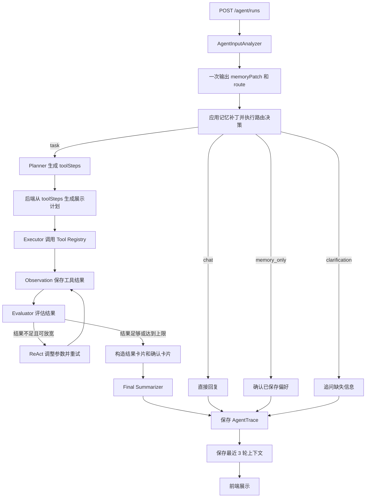

# MyQA 智能 Agent 架构学习文档

> 本文以当前仓库代码为准，目标是让读者快速看懂 MyQA Agent 的请求分流、模型调用、工具执行、记忆、ReAct 修正、最终总结和执行轨迹。

## 1. 先看结论

MyQA Agent 不是“每句话都执行一遍工具链”的聊天机器人，而是一个带请求分流的任务执行器：

```text
用户输入
  -> AgentInputAnalyzer：一次模型调用同时输出 memoryPatch 和 route
  -> 应用 memoryPatch：必要时写入长期偏好
  -> 使用 route：判断 chat / memory_only / task / clarification
  -> chat：直接回复
  -> memory_only：保存偏好后直接回复
  -> clarification：信息不足时先追问，不执行工具
  -> task：Planner 选择工具步骤
           -> Executor 顺序调用工具
           -> Evaluator 检查搜索结果
           -> 必要时进行最多 2 轮 ReAct 修正
           -> Final Summarizer 基于真实结果生成答案
  -> 保存 Trace 和最近 3 轮上下文
  -> 前端展示答案、卡片和完整执行轨迹
```

当前架构可以概括为：

```text
AgentInputAnalyzer + Confidence + Clarification + Memory + Planner + Tools + Rule-based ReAct + AI Final Summary + Trace
```

其中最重要的设计约束是：

1. 普通聊天、偏好表达和待澄清请求不进入完整工具链。
2. Planner 只决定 `intent` 和可执行的 `toolSteps`。
3. 页面上的自然语言计划由后端根据 `toolSteps` 生成，不让模型重复生成一份可能不一致的计划。
4. 工具输出是最终回答的事实来源，Final Summarizer 不能编造执行结果。
5. 转人工等高影响动作只生成确认卡片，用户确认后才真正执行。
6. Trace 展示的是安全的执行摘要，不是模型完整思维链。

## 2. 总体架构



这不是纯 Plan，也不是纯 ReAct：

- `Planner` 提前确定主要工具顺序，流程稳定。
- `Executor` 只执行通过白名单校验的工具。
- `Evaluator + ReAct` 只在搜索结果不足时局部修正，避免无限循环。
- `Final Summarizer` 在最后根据真实结果组织自然语言回答。

## 3. 核心文件

### 3.1 后端

| 文件 | 主要职责 |
| --- | --- |
| `src/routes/agent.js` | Agent HTTP API、鉴权、参数检查和 Trace 序列化 |
| `src/agent/agentExecutor.js` | 主编排器，串联整个执行流程 |
| `src/agent/agentInputAnalyzer.js` | 一次模型调用同时分析记忆补丁和请求路由 |
| `src/agent/agentRequestRouter.js` | 路由归一化、confidence 策略和规则保护 |
| `src/agent/agentRequestRouter.test.js` | confidence、缺参追问和 Guard 的单元测试 |
| `src/agent/agentMemoryExtractor.js` | 归一化 memoryPatch，并提供规则兜底记忆补丁 |
| `src/agent/agentMemoryService.js` | 保存长期偏好和最近 3 轮上下文 |
| `src/agent/agentPlanner.js` | 选择、校验并排序工具步骤 |
| `src/agent/agentToolRegistry.js` | 统一注册和调用平台工具 |
| `src/agent/agentEvaluator.js` | 判断搜索结果是否足够并生成修正参数 |
| `src/agent/agentFinalSummarizer.js` | 基于真实执行结果生成最终回答 |
| `src/models/AgentMemoryModel.js` | MongoDB 记忆模型 |
| `src/models/AgentTraceModel.js` | MongoDB 执行轨迹模型 |

### 3.2 前端

| 文件 | 主要职责 |
| --- | --- |
| `uni-qa(front)/src/api/agent.js` | 封装 Agent API |
| `uni-qa(front)/src/pages/agent/index.vue` | Agent 输入、记忆、轨迹、结果卡片和确认操作 |
| `uni-qa(front)/src/pages/agent/history.vue` | 历史任务列表和完整步骤展开 |

## 4. HTTP 请求入口

前端点击“启动 Agent”后调用：

```js
agentApi.startRun(goal)
```

它向后端发送：

```http
POST /agent/runs
Content-Type: application/json

{
  "goal": "帮我找 Java 高赏金问题"
}
```

后端入口位于 `src/routes/agent.js`：

```js
router.post('/runs', authMiddleware, async (req, res) => {
  const goal = String(req.body?.goal || '').trim();
  const trace = await runAgentTask({
    userId: req.user.userId,
    goal
  });

  res.status(200).json({
    code: 200,
    data: serializeTrace(trace)
  });
});
```

当前版本是同步执行：后端完成整次任务后一次性返回完整 Trace。代码注释中保留了后续升级 WebSocket 流式轨迹的方向，但目前并不是边执行边推送。

## 5. 主入口 `runAgentTask`

位置：`src/agent/agentExecutor.js`

主流程的真实顺序是：

```js
async function runAgentTask({ userId, goal }) {
  // 1. 先读取当前记忆，作为模型理解用户输入的上下文。
  const currentMemory = await getOrCreateMemory(userId);

  // 2. 一次模型调用同时输出 memoryPatch 和 route，避免两个模型判断互相打架。
  const inputAnalysis = await analyzeAgentInput(goal, serializeMemory(currentMemory));

  // 3. 后端应用 memoryPatch，真正写入长期偏好。
  const updatedMemory = await updateMemoryWithPatch(userId, inputAnalysis.memoryPatch);
  const memory = serializeMemory(updatedMemory);
  const route = inputAnalysis.route;

  // 3. 非任务输入在这里短路；clarification 会直接返回追问。
  if (route.mode !== 'task') {
    return createNonTaskTrace(...);
  }

  // 4. 只有 task 才进入 Planner。
  const plannerResult = await createPlan(goal, memory);

  // 5. 创建运行中的 Trace，然后顺序执行工具。
  const trace = await AgentTraceModel.create(...);
  for (const step of plannerResult.toolSteps || []) {
    // 解析上一步结果 -> 调用工具 -> 保存 Observation -> 评估 -> 必要时修正
  }

  // 6. 生成卡片，让模型基于真实结果写最终回答。
  // 7. 保存 Trace，并把本轮对话写入最近上下文。
}
```

注意：当前代码不是一收到请求就先创建空 `AgentRun`。任务型 Trace 在 Planner 完成后创建；聊天、记忆和追问型 Trace 在路由完成后创建。

## 6. 第一道判断：AgentInputAnalyzer

位置：`src/agent/agentInputAnalyzer.js`，记忆归一化逻辑复用 `src/agent/agentMemoryExtractor.js`

每条输入现在都会先经过 `analyzeAgentInput`。它把原来的“记忆提取”和“请求路由”合并成一次模型调用，一次返回 `memoryPatch` 和 `route`。这样做的原因是：同一句话最好由同一次模型理解，避免记忆模型判断“这是偏好”，Router 模型又判断“这是任务”。`memoryPatch` 不是简单抓关键词，而是结构化记忆补丁：

```json
{
  "shouldRemember": true,
  "operation": "replace",
  "topics": ["硬件"],
  "keywords": ["硬件"],
  "avoidTopics": [],
  "removeTopics": [],
  "removeKeywords": [],
  "removeAvoidTopics": [],
  "minReward": 0,
  "summary": "用户以后只希望推荐硬件问题"
}
```

字段含义：

| 字段 | 含义 |
| --- | --- |
| `shouldRemember` | 是否应该写入长期记忆 |
| `operation` | `add`、`replace` 或 `remove` |
| `topics` | 喜欢的主题 |
| `keywords` | 推荐和排序可使用的关键词 |
| `avoidTopics` | 不希望推荐的主题 |
| `remove*` | 要从现有记忆删除的内容 |
| `minReward` | 长期最低赏金偏好 |
| `summary` | 给用户和调试页面看的简短摘要 |

模型输出的 `memoryPatch` 还会经过 `normalizeMemoryPatch` 白名单归一化。这样做是为了避免任意模型文本直接写进 MongoDB 结构。

模型调用失败时，`AgentInputAnalyzer` 会同时使用规则兜底生成 `memoryPatch` 和 `route`。Trace 中可以通过以下字段判断记忆来源：

```js
{
  source: 'model',
  sourceLabel: '模型提取'
}
```

或者：

```js
{
  source: 'fallback',
  sourceLabel: '规则兜底'
}
```

## 7. 长期记忆如何更新

位置：`src/agent/agentMemoryService.js`

`applyPreferencePatch` 支持三种操作：

### 7.1 `add`

用户说：

```text
以后也推荐硬件问题
```

新主题会和旧主题合并，并按不区分大小写的方式去重。

### 7.2 `replace`

用户说：

```text
以后只推荐硬件问题
```

`topics`、`keywords` 和 `avoidTopics` 会使用新值替换旧值，因此可以覆盖之前的 Java 偏好。

### 7.3 `remove`

用户说：

```text
以后不要推荐 Java 问题
```

Java 会从正向偏好中移除，并加入 `avoidTopics`，供后续排序时降低匹配分。

当前 `minReward` 的更新规则是只升不降：

```js
if (extracted.minReward > preferences.minReward) {
  preferences.minReward = extracted.minReward;
}
```

这意味着“以后最低 50 元”可以把阈值提高到 50，但“以后最低 20 元”不会把已有的 50 降到 20。这是当前实现的明确限制。

## 8. 最近 3 轮上下文

长期偏好和聊天上下文不是同一类数据。

- 长期偏好保存在 `preferences` 和 `summaries`。
- 最近对话保存在 `contextTurns`。

每完成一轮，`appendContextTurn` 写入两条 turn：

```js
[
  { role: 'user', content: goal },
  { role: 'agent', content: finalAnswer, resultCards }
]
```

然后只保留最后 6 条：

```js
memory.contextTurns = [...oldTurns, userTurn, agentTurn].slice(-6);
```

6 条消息等于最近 3 轮完整对话。

`resultCards` 会被压缩后保留最多 5 张。这样用户下一轮说“查看刚才那个问题的申请者”时，Planner 可以从最近问题卡片中补全标题或 `questionId`，而不是只看到一句模糊的“刚才那个”。

## 9. 第二道判断：Request Router

位置：`src/agent/agentRequestRouter.js`

Router 是 Agent 的“分流入口”。它的任务不是执行工具，而是先判断用户这句话到底应该怎么处理：是普通聊天、只写入记忆、真正执行平台任务，还是信息不够需要先追问。

可以把它理解成医院前台分诊：用户来了以后，前台先判断是咨询、更新资料、挂号看病，还是资料不全要先补身份证。只有确实需要看病，才会交给后面的医生，也就是 Planner。

Router 把输入分成四类：

| `mode` | 例子 | Planner | 工具 |
| --- | --- | --- | --- |
| `chat` | “你好”“你能做什么” | 不调用 | 不调用 |
| `memory_only` | “以后优先推荐 Java 问题” | 不调用 | 不调用 |
| `task` | “帮我找 Java 高赏金问题” | 调用 | 调用 |
| `clarification` | “查看那个问题的申请者”，但上下文无法定位问题 | 不调用 | 不调用 |

完整处理顺序是：

```text
AgentInputAnalyzer 先生成 route
  -> Rule Guard 处理明确边界
  -> Confidence Policy 使用置信度阈值做最后放行判断
  -> 如果模型调用失败，使用规则路由兜底
```

AgentInputAnalyzer 中 route 的结构化输出示例：

```json
{
  "mode": "task",
  "intent": "question_discovery",
  "confidence": 0.96,
  "reason": "用户明确要求现在搜索平台问题",
  "shouldExecuteTools": true,
  "missingFields": [],
  "clarificationQuestion": ""
}
```

这些字段不是只给页面看的，它们会直接影响后面是否进入 Planner：

| 字段 | 示例值 | 代码位置 | 作用 |
| --- | --- | --- | --- |
| `mode` | `task` | `normalizeMode` | Router 对当前输入的第一判断，只允许 `chat / memory_only / task / clarification` |
| `intent` | `question_discovery` | `analyzeAgentInput` | 给 Planner 和最终总结一个任务方向，例如找问题、查退款、转人工 |
| `confidence` | `0.96` | `normalizeConfidence` | 模型对 `mode` 判断的自评置信度，后面会和 `0.65` 阈值比较 |
| `reason` | `用户明确要求搜索平台问题` | `analyzeAgentInput` | 解释模型为什么这样分类，主要用于 Trace 调试 |
| `shouldExecuteTools` | `true` | `applyRouteGuard` / `applyConfidencePolicy` | 最终是否允许进入 Planner 和平台工具链 |
| `missingFields` | `["questionId"]` | `applyRouteGuard` | 缺少关键参数时，强制进入追问，不执行工具 |
| `clarificationQuestion` | `请提供问题标题或 questionId` | `buildClarificationAnswer` | 需要追问时直接展示给用户的问题 |
| `guardReason` | `检测到明确执行意图...` | `applyRouteGuard` | Rule Guard 改写或确认路由的原因 |
| `confidenceThreshold` | `0.65` | `applyConfidencePolicy` | 当前任务型请求的放行阈值 |
| `confidenceDecision` | `accepted` | `applyConfidencePolicy` | confidence 策略的最终决策结果 |

### 9.1 confidence 到底怎么用

位置：`applyConfidencePolicy`

当前任务置信度阈值写死为：

```js
const TASK_CONFIDENCE_THRESHOLD = 0.65;
```

也就是说，模型如果判断用户是在发起 `task`，但它自己给出的置信度低于 `0.65`，系统不会马上执行工具，而是倾向于先追问。

模型返回的 `confidence` 会先由 `normalizeConfidence` 归一化到 `0~1`：

| 模型原始返回 | 归一化后 | 说明 |
| --- | --- | --- |
| `0.96` | `0.96` | 已经是标准小数，直接使用 |
| `85` | `0.85` | 兼容模型把百分制写成 85 的情况 |
| `120` | `1` | 超过上限时压到 1 |
| `-0.2` | `0` | 小于下限时抬到 0 |
| `"abc"` | `0` | 非数字按 0 处理 |

这一步像把不同老师给的分数统一成百分比：有的老师写 85 分，有的老师写 0.85，系统先统一成 `0~1`，后面才好和 `0.65` 比较。

### 9.2 confidence 决策表

`applyConfidencePolicy` 的核心规则可以这样记：

```text
如果 mode 不是 task：
  不靠 confidence 放行工具。

如果 mode 是 task：
  confidence >= 0.65：可以进入 Planner。
  confidence < 0.65 且没有明确执行 Guard：改成 clarification。
  confidence < 0.65 但有明确执行 Guard：可以进入 Planner。
```

更完整的表：

| 进入 confidence 策略前的状态 | confidence | 是否有明确执行 Guard | 最终结果 |
| --- | --- | --- | --- |
| `mode = task` | `0.90` | 无所谓 | 保持 `task`，`confidenceDecision = accepted` |
| `mode = task` | `0.65` | 无所谓 | 保持 `task`，因为等于阈值也算通过 |
| `mode = task` | `0.64` | 没有 | 改成 `clarification`，`confidenceDecision = below_task_threshold` |
| `mode = task` | `0.40` | 有，且没有缺参数 | 保持 `task`，因为用户明确说了“帮我查/统计/查看”等执行命令 |
| `mode = clarification` | 任意值 | 无所谓 | 保持 `clarification`，`confidenceDecision = clarification_requested` |
| `mode = memory_only` | 任意值 | 无所谓 | 保持 `memory_only`，不进入工具链 |
| `mode = chat` | 任意值 | 无所谓 | 保持 `chat`，不进入工具链 |

注意：明确执行 Guard 不是“万能通行证”。它只在参数完整时帮助低置信度任务放行。只要 `missingFields` 里有关键参数缺失，仍然必须追问。

低置信度追问会在 Trace 中记录：

```json
{
  "mode": "clarification",
  "confidence": 0.52,
  "confidenceThreshold": 0.65,
  "confidenceDecision": "below_task_threshold",
  "shouldExecuteTools": false
}
```

`confidenceDecision` 的含义：

| `confidenceDecision` | 含义 | 学习时怎么理解 |
| --- | --- | --- |
| `accepted` | 当前路由被接受 | “分诊通过，可以继续” |
| `below_task_threshold` | 模型觉得像任务，但分数低于 `0.65`，且没有明确执行 Guard | “不确定是不是要执行，先问清楚” |
| `clarification_requested` | 模型已经要求追问，或缺少关键参数 | “信息不够，不能安全执行” |

为什么不是只看 `confidence`？因为模型的置信度是“自评”，不是严格概率。它有时会偏保守或偏自信，所以系统还要结合三个信号：

| 信号 | 代码函数 | 作用 |
| --- | --- | --- |
| 缺少关键参数 | `missingFields` | 最高优先级，只要缺参数就先追问 |
| 未来偏好表达 | `hasFutureMemoryIntent` | 判断“以后、下次、后续推荐...”是不是只应该写入记忆 |
| 明确执行表达 | `hasExplicitExecutionIntent` | 判断“帮我查、统计、查看、退款”等是不是应该进入任务 |

形象比喻：`confidence` 像导航软件说“我有 65% 把握这条路对”。如果路牌也写着“去医院请左转”，那就可以左转；但如果前方桥断了，也就是缺少 `questionId` 这类关键参数，再自信也不能开过去，必须先停车问路。

### 9.3 Rule Guard 的处理顺序

`Rule Guard` 位于 `applyRouteGuard`。它不是要替代模型，而是处理很明确的边界情况，防止模型把明显的偏好或缺参任务误放行。

优先级如下：

| 优先级 | 判断条件 | 例子 | 最终 `mode` | 为什么 |
| --- | --- | --- | --- | --- |
| 1 | `memoryExtraction.shouldRemember = true` 且命中未来偏好 | “以后帮我推荐硬件问题” | `memory_only` | 用户是在设置长期规则，不是在要求现在搜索 |
| 2 | `missingFields.length > 0` | “查看这个问题的申请者”，但没有上下文定位问题 | `clarification` | 缺少 `questionId`，执行会查错对象 |
| 3 | 模型已经返回 `mode = clarification` | “帮我处理一下那个” | `clarification` | 模型判断目标不清楚，先问 |
| 4 | 命中明确执行意图 | “帮我查 Java 问题” | `task` | 用户明确要求现在执行 |
| 5 | 都没命中 | “我有点累” | 保持模型原判断，通常是 `chat` | 没有平台任务 |

几个关键点：

1. `memory_only` 优先于执行工具。比如“以后帮我推荐硬件问题”只保存偏好，不搜索问题。
2. `missingFields` 优先于执行工具。比如“查看这个问题申请者”缺少 `questionId` 时，即使命中“查看”，也不能查。
3. `clarification` 不会被关键词强行覆盖。模型已经判断信息不足，就先追问。
4. 只有参数完整，并且命中明确执行表达，才会用 Guard 帮忙放行。

`Rule Guard` 不负责数据库权限，它只负责避免明显的路由错误。用户身份和数据归属仍由 `authMiddleware` 与工具查询条件检查。

### 9.4 几个输入例子完整走一遍

#### 例子 A：明确执行任务

用户输入：

```text
帮我查 Java 高赏金问题
```

可能的 Router 原始输出：

```json
{
  "mode": "task",
  "intent": "question_discovery",
  "confidence": 0.82,
  "shouldExecuteTools": true,
  "missingFields": [],
  "clarificationQuestion": ""
}
```

后续处理：

```text
applyRouteGuard
  -> 命中“帮我查”，确认是明确执行任务
  -> mode 保持 task

applyConfidencePolicy
  -> 0.82 >= 0.65
  -> confidenceDecision = accepted
  -> 进入 Planner
```

最终会调用 Planner 和工具。

#### 例子 B：低置信度但没有明确执行信号

用户输入：

```text
Java 那个看看
```

可能的 Router 原始输出：

```json
{
  "mode": "task",
  "intent": "question_discovery",
  "confidence": 0.48,
  "shouldExecuteTools": true,
  "missingFields": [],
  "clarificationQuestion": ""
}
```

后续处理：

```text
applyRouteGuard
  -> 没有明显“帮我查/统计/查看某个明确对象”的执行信号
  -> 暂时不强行放行

applyConfidencePolicy
  -> 0.48 < 0.65
  -> mode 改成 clarification
  -> shouldExecuteTools = false
```

最终不会调用 Planner，而是问用户：“请补充要查询或处理的具体内容。”

#### 例子 C：明确缺少关键参数

用户输入：

```text
查看这个问题的所有申请者
```

如果最近 3 轮上下文里没有可定位的问题卡片，Router 可能输出：

```json
{
  "mode": "clarification",
  "intent": "question_applicants",
  "confidence": 0.76,
  "shouldExecuteTools": false,
  "missingFields": ["questionId"],
  "clarificationQuestion": "请告诉我你要查看哪个问题，可以提供问题标题或 questionId。"
}
```

后续处理：

```text
applyRouteGuard
  -> 发现 missingFields 有 questionId
  -> 强制保持 clarification

applyConfidencePolicy
  -> mode 已经是 clarification
  -> confidenceDecision = clarification_requested
  -> 不调用工具
```

这里即使 `confidence = 0.76` 大于 `0.65`，也不能执行。因为高置信度只说明“它像一个查申请者任务”，不代表参数齐了。

#### 例子 D：只写入记忆

用户输入：

```text
以后推荐给我硬件问题
```

AgentInputAnalyzer 的 `memoryPatch` 可能输出：

```json
{
  "shouldRemember": true,
  "operation": "replace",
  "topics": ["硬件"],
  "keywords": ["硬件"],
  "summary": "用户希望以后优先推荐硬件相关问题"
}
```

后续处理：

```text
applyRouteGuard
  -> 检测到“以后 + 推荐”这类未来偏好表达
  -> mode = memory_only
  -> shouldExecuteTools = false
```

最终只保存偏好，不会完整执行“搜索问题 -> 排序 -> 推荐”的工具链。

#### 例子 E：一句话里既有任务又有“以后”

用户输入：

```text
帮我查 Java 问题，以后有点累了
```

这句话里虽然有“以后”，但“以后有点累了”不是偏好设置，不是“以后推荐 Java”。所以：

```text
hasFutureMemoryIntent = false
hasExplicitExecutionIntent = true
最终 mode = task
```

这就是为什么 Rule Guard 没有简单粗暴地看到“以后”就改成 `memory_only`，而是要求“以后/下次/后续”和“推荐/优先/记住/偏好/不要”等词形成偏好表达。
## 10. 非任务输入为什么不会完整执行

当 `route.mode !== 'task'` 时，执行器调用 `createNonTaskTrace`。

### 普通聊天

只保存两类步骤：

```text
chat -> final
```

### 只更新偏好

只保存：

```text
memory -> final
```

### 需要用户补充信息

保存：

```text
clarification -> final
```

Trace 状态为：

```text
waiting_clarification
```

最终回答直接使用 Router 生成的 `clarificationQuestion`。如果模型没有提供问题，后端会生成通用追问。该分支不会调用 Planner 和任何平台工具。

这三种分支都不会调用 Planner、`search_questions` 或其他平台工具。它们仍然保存 Trace，目的是让用户能在历史记录中看到自己说过什么、系统怎样处理，而不是假装没有发生过。

## 11. Planner 的真实职责

位置：`src/agent/agentPlanner.js`

Planner 的职责不是写一段好看的计划，而是生成机器可执行的工具步骤：

```json
{
  "intent": "question_discovery",
  "toolSteps": [
    {
      "toolName": "get_user_profile",
      "input": {},
      "inputFrom": ""
    },
    {
      "toolName": "search_questions",
      "input": {
        "keyword": "Java",
        "topic": "Java",
        "minReward": 20,
        "limit": 20
      },
      "inputFrom": ""
    },
    {
      "toolName": "rank_questions_for_user",
      "input": {},
      "inputFrom": "search_questions"
    }
  ],
  "needsConfirmation": false
}
```

模型不再输出单独的自然语言 `plan`。原因是模型可能说“先查画像再搜索”，实际 `toolSteps` 却只调用知识库，导致页面计划与执行轨迹不一致。

现在由后端执行以下转换：

```js
const plan = buildExecutablePlan(toolSteps, modelPlan?.needsConfirmation);
```

`describeToolStep` 把每个真实工具转换成展示文案，例如：

```text
get_user_profile -> 读取用户画像和偏好记忆
search_questions -> 搜索平台待回答问题
rank_questions_for_user -> 按用户偏好、赏金和新鲜度排序
```

因此页面计划一定来源于已经校验过的 `toolSteps`。

## 12. Planner 如何保证工具可执行

`normalizeModelPlan` 会进行三层约束：

1. 只读取数组形式的 `toolSteps`。
2. 把步骤归一化为 `toolName / input / inputFrom`。
3. 使用 `listTools()` 建立白名单，过滤不存在的工具，最多保留 5 步。

核心逻辑：

```js
const allowedTools = new Set(listTools().map((tool) => tool.name));

const toolSteps = rawSteps
  .map((step) => ({
    toolName: step.toolName || step.name || '',
    input: step.input && typeof step.input === 'object' ? step.input : {},
    inputFrom: step.inputFrom || ''
  }))
  .filter((step) => allowedTools.has(step.toolName))
  .slice(0, 5);
```

如果模型没有生成任何合法工具，并且也不需要用户确认，则使用 `fallbackPlan`。Trace 会记录：

```json
{
  "plannerSource": "fallback",
  "plannerSourceLabel": "规则兜底",
  "plannerFallbackReason": "模型计划没有可执行工具"
}
```

如果模型成功，则是：

```json
{
  "plannerSource": "model",
  "plannerSourceLabel": "模型 Planner",
  "plannerFallbackReason": ""
}
```

## 13. Tool Registry

位置：`src/agent/agentToolRegistry.js`

当前共注册 9 个工具：

| 工具 | 作用 |
| --- | --- |
| `get_user_profile` | 查询用户画像和历史行为统计 |
| `get_user_question_stats` | 统计当前用户发布的问题 |
| `get_question_applicants` | 查询指定问题的申请者 |
| `search_questions` | 搜索当前待回答问题 |
| `rank_questions_for_user` | 根据记忆、赏金和新鲜度排序 |
| `get_recent_transactions` | 查询最近问答交易 |
| `get_refund_status` | 查询退款记录和状态 |
| `search_knowledge_base` | 检索现有 RAG 知识库 |
| `create_handoff_request` | 用户确认后创建人工客服请求 |

每个工具遵循接近 MCP Tool 的结构：

```js
{
  name: 'search_questions',
  description: '搜索平台当前待回答的问题',
  inputSchema: {
    type: 'object',
    properties: {
      keyword: { type: 'string' },
      topic: { type: 'string' },
      minReward: { type: 'number' },
      limit: { type: 'number' }
    }
  },
  async handler({ userId, input, memory }) {
    // 调用真实平台数据层并返回结构化结果。
  }
}
```

统一入口是：

```js
await callTool(toolName, { userId, input, memory });
```

如果工具不存在，`callTool` 会抛错，不会让模型随意调用一个没有实现的名字。

## 14. Executor 如何连接多个工具

Planner 可能让下一步使用上一步输出。例如排序工具需要搜索结果。

支持两种写法：

```json
{
  "toolName": "rank_questions_for_user",
  "inputFrom": "search_questions"
}
```

或者：

```json
{
  "toolName": "rank_questions_for_user",
  "input": {
    "questions": "$search_questions.results"
  }
}
```

执行前，`resolveStepInput` 和 `resolveInputReferences` 会把引用替换成真实数组：

```js
if (step.inputFrom === 'search_questions') {
  return {
    questions: toolResults.search_questions?.list || []
  };
}
```

这解决了曾经把字符串 `"$search_questions.results"` 原样传给排序工具的问题。

## 15. 每次工具调用如何写入 Trace

`executeToolStep` 会写入两个独立事件：

```text
tool_call -> observation
```

代码结构：

```js
trace.steps.push({
  type: 'tool_call',
  toolName: step.toolName,
  input
});

const output = await callTool(step.toolName, {
  userId,
  input,
  memory
});

trace.steps.push({
  type: 'observation',
  toolName: step.toolName,
  output
});
```

所以一次工具调用不是一个大 `steps` 文档，而是“调用动作”和“返回观察”两个事件。这样可以分别回答：

- Agent 准备用什么参数调用？
- 工具实际返回了什么？

## 16. Evaluator 和 ReAct 修正

位置：`src/agent/agentEvaluator.js`

当前 ReAct 不是再次调用大模型思考，而是确定性评估器，只对 `search_questions` 生效。

判断规则：

1. 搜索结果达到 3 条：认为足够。
2. 用户说“必须、只能、严格、不要放宽”等强约束：即使少于 3 条也不放宽。
3. 已修正 2 轮：停止，避免无限搜索。
4. 其他结果不足情况：生成新的搜索参数。

放宽策略位于 `buildRelaxedQuestionSearchInput`：

```js
return {
  ...input,
  keyword: keyword && keyword !== '编程' ? '编程' : keyword,
  topic: topic && topic !== '编程' ? '' : topic,
  minReward: minReward > 10 ? Math.floor(minReward / 2) : 0,
  limit: Math.max(input.limit || 20, 20)
};
```

执行循环：

```js
while (
  !evaluation.sufficient &&
  evaluation.nextAction === 'relax_search' &&
  reactCount < 2
) {
  reactCount += 1;
  // 记录 react_reason
  // 使用 adjustedInput 再次调用 search_questions
  // 合并并去重前后两次结果
  // 再次 evaluation
}
```

搜索结果通过 `questionId` 合并去重，避免同一个问题在多轮结果中重复显示。

## 17. Final Summarizer

位置：`src/agent/agentFinalSummarizer.js`

工具执行结束后，系统先构造：

- `resultCards`：问题推荐、问题统计、申请者、退款、交易和条件调整卡片。
- `actionCards`：需要用户确认的动作卡片。
- `fallbackAnswer`：模型失败时使用的确定性回答。

然后调用 Final Summarizer。模型收到的是压缩后的执行事实：

```text
用户目标
Planner 结果
Trace 摘要
工具结果
结果卡片
待确认动作
用户记忆
规则兜底回答
```

模型必须返回：

```json
{
  "finalAnswer": "找到 3 个符合条件的问题，已按匹配度排序。",
  "statusLabel": "已找到结果",
  "nextActions": ["查看第一个问题", "继续提高赏金条件"]
}
```

提示词明确要求：

- 只能根据工具结果总结。
- 没查到就明确说没查到。
- 不能使用“已完成分析并给出建议”这种没有事实内容的空话。
- 有确认卡片时，要说明确认后才能执行。

模型调用失败时，`buildFinalSummaryWithModel` 返回 `buildFinalAnswer` 生成的规则回答，并在 Trace 中记录 `finalSummarySource: "fallback"` 和失败原因。

## 18. 一次请求会调用几次模型

当前主流程已经把原来的 `Memory Extractor` 和 `AI Router` 合并为一次 `AgentInputAnalyzer` 调用。

也就是说，这两件事现在由同一次模型理解完成：

```text
用户输入
  -> AgentInputAnalyzer
       -> memoryPatch：要不要写入长期偏好
       -> route：chat / memory_only / task / clarification
```

这样改的原因是：同一句话如果拆成两个模型分别判断，可能出现“记忆模型觉得是偏好，Router 又觉得是任务”的不一致。合并后，模型在同一个上下文里同时决定“是否记忆”和“是否执行”，一致性更好，也少一次模型延迟。

当前正常路径如下：

| 输入类型 | AgentInputAnalyzer | Planner | Final Summarizer | 通常总次数 |
| --- | --- | --- | --- | --- |
| 普通聊天 | 1 | 0 | 0 | 1 |
| 只更新偏好 | 1 | 0 | 0 | 1 |
| 需要追问 | 1 | 0 | 0 | 1 |
| 执行平台任务 | 1 | 1 | 1 | 3 |
| 用户确认动作 | 0 | 0 | 0 | 0 |

这里统计的是正常情况下的模型调用尝试。任一模型调用失败后，相应模块会使用规则兜底。

需要特别区分：

- `AgentInputAnalyzer` 是一次模型调用，但会返回两个结果：`memoryPatch` 和 `route`。
- `normalizeMemoryPatch`、`applyRouteGuard`、`applyConfidencePolicy` 都是代码逻辑，不是模型调用。
- ReAct 修正当前不调用模型。
- MongoDB 查询和 RAG 检索属于工具调用，不属于模型调用。
- Planner 只调用一次，不会每执行一步都重新调用模型。

当前说明：`agentMemoryExtractor.js` 不再单独调用模型，只负责记忆补丁归一化和规则兜底；`agentRequestRouter.js` 不再单独调用模型，只负责规则兜底、路由保护和 confidence 策略。
## 19. Trace 数据模型

位置：`src/models/AgentTraceModel.js`

一个 `AgentTrace` 代表一次用户请求：

```js
{
  userId,
  goal,
  status, // running / waiting_confirmation / waiting_clarification / completed / failed
  plan,
  steps,
  finalAnswer,
  resultCards,
  actionCards,
  memorySnapshot,
  createdAt,
  updatedAt
}
```

`steps` 是同一次请求内部的事件数组。每个子文档不是重复的一整次任务，而是一个时间点发生的动作：

```js
{
  type,
  title,
  toolName,
  input,
  output,
  summary,
  createdAt
}
```

当前步骤类型：

| 类型 | 含义 |
| --- | --- |
| `plan` | 已生成并校验执行计划 |
| `tool_call` | 准备调用工具，`input` 保存参数 |
| `observation` | 工具调用完成，`output` 保存结果 |
| `evaluation` | 评估结果是否足够 |
| `react_reason` | 说明为什么需要修正 |
| `react_action` | 使用新参数再次调用工具 |
| `react_observation` | 保存修正后的工具结果 |
| `memory` | 本轮只更新记忆 |
| `chat` | 本轮是普通聊天 |
| `clarification` | 置信度不足或缺少参数，等待用户补充 |
| `decision` | 汇总卡片数量、总结来源和下一步 |
| `final` | 保存最终回答 |
| `error` | 保存执行异常 |

例如一次包含 3 个工具的任务，正常就可能有：

```text
1 plan
2 tool_call
3 observation
4 tool_call
5 observation
6 evaluation
7 tool_call
8 observation
9 decision
10 final
```

因此 9 个或 10 个 `steps` 很正常。`AgentTrace` 是整次问题，`steps[n]` 是整次问题中的单个事件。

## 20. 前端历史记录为什么先显示 4 步

位置：`uni-qa(front)/src/pages/agent/history.vue`

历史页默认只截取前 4 步，避免每张历史卡片过长：

```js
return isExpanded(item.runId) ? steps : steps.slice(0, 4);
```

当总步骤超过 4 时显示“展开全部 N 步”按钮。点击后展示数据库中保存的全部 `steps`，包括每一步的摘要、输入和输出。

所以“页面先看到 4 步”不代表数据库只保存了 4 步。

## 21. Human-in-the-loop

当前高影响动作是 `create_handoff_request`。

第一次运行时，Agent 只生成动作卡片：

```json
{
  "type": "handoff_confirm",
  "confirmAction": "create_handoff_request",
  "payload": {
    "message": "用户请求转人工"
  }
}
```

此时 Trace 状态是：

```text
waiting_confirmation
```

用户点击确认后，前端调用：

```http
POST /agent/action-confirm
```

后端 `confirmAgentAction` 会验证：

1. Trace 属于当前用户。
2. `actionType` 确实存在于该 Trace 的 `actionCards`。
3. 验证通过后才调用工具。

执行成功后清空动作卡片，并把 Trace 状态改为 `completed`。

## 22. 完整例子：帮我找 Java 高赏金问题

### 22.1 AgentInputAnalyzer

输入是一次性查询，没有“以后、记住、偏好”等稳定偏好表达，因此 `memoryPatch` 通常是：

```json
{
  "shouldRemember": false,
  "operation": "add",
  "topics": [],
  "keywords": [],
  "minReward": 0
}
```

同时，“帮我找”是明确执行目标，因此同一次模型调用里的 `route` 通常是：

```json
{
  "mode": "task",
  "intent": "question_discovery",
  "confidence": 0.9,
  "shouldExecuteTools": true,
  "missingFields": []
}
```

后端随后会做两件事：

```text
1. updateMemoryWithPatch：因为 shouldRemember=false，所以只记录本轮提取元信息，不写长期偏好。
2. finalizeRoute：确认这是 task，并通过 confidence / Rule Guard 检查。
```

现有长期偏好仍会被读取并传给后续模块，但本句话不会自动写成长久偏好。
### 22.3 Planner

Planner 获得：

- 原始目标。
- 当前长期偏好。
- 最近 3 轮上下文和压缩卡片。
- 9 个可用工具的描述和输入结构。

它选择：

```text
get_user_profile
  -> search_questions
  -> rank_questions_for_user
```

后端根据这 3 个真实步骤生成页面计划，而不是展示模型另写的一份计划文案。

### 22.4 第一次搜索

Executor 调用：

```json
{
  "keyword": "Java",
  "topic": "Java",
  "minReward": 20,
  "limit": 20
}
```

假设返回：

```json
{
  "total": 1,
  "list": [
    {
      "questionId": "q1",
      "title": "Spring 事务为什么没有生效",
      "topic": "Java",
      "reward": 30
    }
  ]
}
```

### 22.5 Evaluator

候选只有 1 条，小于 3 条。如果用户没有说“必须是 Java、不要放宽”，Evaluator 会返回：

```json
{
  "sufficient": false,
  "nextAction": "relax_search",
  "toolName": "search_questions",
  "adjustedInput": {
    "keyword": "编程",
    "topic": "",
    "minReward": 10,
    "limit": 20
  }
}
```

### 22.6 ReAct

Executor 使用新参数再次调用 `search_questions`，把新旧结果按 `questionId` 合并，并再次评估。最多重复 2 轮。

Trace 中会增加：

```text
react_reason
react_action
react_observation
evaluation
```

### 22.7 排序

`rank_questions_for_user` 收到合并后的真实问题数组，结合以下因素计算匹配分：

- 长期偏好主题和关键词。
- `avoidTopics`。
- 问题标签和分类。
- 赏金。
- 发布时间。

然后返回最多 6 条结果。

### 22.8 最终回答

执行器构造推荐卡片和条件调整卡片，Final Summarizer 根据真实结果生成类似：

```text
找到 4 个相关问题。由于严格的 Java 高赏金候选只有 1 个，我把关键词放宽到“编程”，并把最低赏金从 20 元降到 10 元；结果已按你的偏好、赏金和发布时间排序。
```

这个答案不是 Planner 提前写好的，而是在所有工具完成后生成。

## 23. 其他请求如何执行

### 23.1 “以后优先推荐 Java 问题”

```text
AgentInputAnalyzer -> 生成 Java memoryPatch
route -> memory_only
createNonTaskTrace -> memory + final
```

不调用搜索工具。

### 23.2 “我一共发布了几个问题”

```text
route -> task
Planner -> get_user_question_stats
Executor -> 查询 MongoDB
Final Summarizer -> 回答总数和状态分布
```

### 23.3 “查看刚才那个问题的所有申请者”

```text
Planner 读取最近 contextTurns.resultCards
  -> 从最近问题卡片补全问题标题或 ID
  -> get_question_applicants
  -> 返回申请者卡片
```

如果 Router 已确认上下文无法定位问题，它会直接返回 `clarification`，要求用户提供标题或 `questionId`，不会先调用工具。只有 Router 认为信息足够但工具仍无法匹配时，工具才返回 `needsQuestionSelection: true` 和用户最近发布的问题列表。

对应 Trace 示例：

```json
{
  "status": "waiting_clarification",
  "steps": [
    {
      "type": "clarification",
      "output": {
        "route": {
          "confidence": 0.72,
          "missingFields": ["questionId"],
          "confidenceDecision": "clarification_requested"
        }
      }
    }
  ],
  "finalAnswer": "请告诉我你要查看哪个问题，可以提供问题标题或 questionId。"
}
```

### 23.4 “我的退款处理到哪一步了”

典型工具链：

```text
get_user_profile
  -> get_refund_status
  -> search_knowledge_base
  -> Final Summarizer
```

如果没有退款记录，最终回答必须明确说明没有查到；系统还可以生成转人工确认卡片，而不是声称“已经处理完成”。

## 24. API 列表

| 方法 | 路径 | 用途 |
| --- | --- | --- |
| `GET` | `/agent/tools` | 查看当前工具定义 |
| `GET` | `/agent/memory` | 查看当前用户记忆 |
| `POST` | `/agent/runs` | 执行一次输入 |
| `GET` | `/agent/runs` | 查询历史任务 |
| `GET` | `/agent/runs/:runId` | 查询单次完整 Trace |
| `POST` | `/agent/action-confirm` | 确认并执行高影响动作 |

所有接口都经过 `authMiddleware`，历史记录和确认动作都按当前用户隔离。

## 25. 如何新增一个工具

以“查看某个问题所有申请者”为例，正确扩展方式不是在 Planner 里堆一整套固定意图流程，而是增加一个能力原子。

### 第一步：注册工具

```js
get_question_applicants: {
  name: 'get_question_applicants',
  description: '查询当前用户指定问题的所有申请回答用户',
  inputSchema: {
    type: 'object',
    properties: {
      questionId: { type: 'string' },
      questionTitle: { type: 'string' }
    }
  },
  async handler({ userId, input }) {
    // 先验证问题属于当前用户，再查询申请记录。
  }
}
```

### 第二步：让 Planner 看到工具

不需要手动维护一份额外工具清单。`createModelPlan` 会调用 `listTools()`，新工具会自动出现在 Planner 提示词中。

### 第三步：补充结果卡片

如果工具结果需要专门展示，在 `agentExecutor.js` 增加对应 `build*Cards`。

### 第四步：补充兜底

模型不可用时仍需工作，因此可以在 `fallbackPlan` 增加最小规则兜底。这里的规则负责可用性，不应取代模型对所有表达方式的理解。

### 第五步：补测试

至少覆盖：

- 参数完整时能正确执行。
- 参数缺失时返回可选择项。
- 非本人问题不能越权查询。
- 工具失败时 Trace 保存 `error`。

## 26. 排查问题时看哪些字段

### 计划是否来自模型

查看 `steps[0].output`：

```json
{
  "plannerSourceLabel": "模型 Planner",
  "plannerFallbackReason": ""
}
```

### 记忆是否由模型提取

查看：

```json
{
  "memoryExtraction": {
    "sourceLabel": "模型提取",
    "shouldRemember": false
  }
}
```

### 最终答案是否由模型生成

查看 `decision.output`：

```json
{
  "finalSummarySource": "model",
  "finalSummaryFallbackReason": ""
}
```

### 为什么实际工具和计划不一致

当前页面计划已经从校验后的 `toolSteps` 生成。若仍出现不一致，应依次检查：

1. `plan` 中的后端展示文案。
2. Trace 中每个 `tool_call.toolName`。
3. Planner 是否触发 `fallback`。
4. 是否在 ReAct 阶段追加了 `react_action`。ReAct 是运行时修正，不会预先出现在初始计划中。

### 为什么没有进入 Planner

查看非任务步骤的 `output.route`：

```json
{
  "mode": "clarification",
  "confidence": 0.52,
  "confidenceThreshold": 0.65,
  "confidenceDecision": "below_task_threshold",
  "missingFields": []
}
```

- `below_task_threshold`：任务置信度低于阈值。
- `clarification_requested`：模型要求追问，或者缺少关键字段。
- `accepted`：置信度策略接受了当前路由。

## 27. 当前限制和后续优化

1. 当前 HTTP 接口同步返回，执行过程较长时前端只能等待；可升级为 WebSocket 或 SSE 流式 Trace。
2. ReAct 只支持问题搜索放宽，并且是规则评估；可增加模型评估，但必须限制轮数和可调用工具。
3. Router 已使用 `0.65` 阈值和 `clarification` 分支，但模型 confidence 并非严格校准概率；后续可以使用真实误判样本校准阈值。
4. `minReward` 当前只升不降，需要增加明确的 replace/remove 数值语义。
5. Trace 使用嵌入式 `steps` 数组，任务很长时文档会变大；可拆成独立事件集合并按 `runId` 分页。
6. Planner 工具参数目前主要依赖提示词和运行时兜底，后续可增加 JSON Schema 参数校验。
7. 最终总结虽然禁止编造，但仍应增加程序化事实校验，例如卡片数量和回答中的数量一致性检查。
8. 当前聊天分支使用简单模板，不是完整多轮聊天模型；如果要更像 Codex，可给 `chat` 分支增加单独的对话模型。

## 28. 快速复习

只记住下面 10 句话即可：

1. 每条输入先提取记忆，再做请求路由。
2. `chat`、`memory_only` 和 `clarification` 不调用 Planner 和平台工具。
3. 只有通过 confidence、缺参检查和 Guard 的 `task` 才进入 Planner。
4. Planner 输出 `intent / toolSteps / needsConfirmation`。
5. 展示计划由后端根据合法 `toolSteps` 生成。
6. Executor 顺序调用 Tool Registry 中的真实工具。
7. `search_questions` 结果不足时最多进行 2 轮规则 ReAct。
8. Final Summarizer 根据真实工具结果生成最终答案。
9. 一个 Trace 代表一次请求，`steps` 代表这次请求中的多个事件。
10. 长期偏好单独保存，短期上下文保留最近 3 轮。

推荐阅读代码的顺序：

```text
routes/agent.js
  -> agentExecutor.js
  -> agentMemoryExtractor.js
  -> agentRequestRouter.js
  -> agentPlanner.js
  -> agentToolRegistry.js
  -> agentEvaluator.js
  -> agentFinalSummarizer.js
  -> AgentTraceModel.js / AgentMemoryModel.js
  -> 前端 index.vue / history.vue
```


## 29. 学习版全链路详解

前面的章节按模块介绍了 Agent。这里换一种更适合学习的方式：按一次请求从进来到结束的真实顺序，把每一步的输入、输出、关键参数、为什么这样做、容易误解的点都讲清楚。

可以先记住一句话：

```text
这个 Agent 不是“用户说一句，模型直接回答一句”。
它是“模型判断 + 程序校验 + 工具执行 + 结果再总结”的组合系统。
```

也就是说，模型负责理解和组织语言，代码负责约束边界、调用真实工具、保存轨迹。

### 29.1 总流程像一次外卖下单

可以把 Agent 流程类比成外卖系统：

| Agent 模块 | 外卖类比 | 作用 |
| --- | --- | --- |
| `AgentInputAnalyzer` | 同时判断你不吃辣、以及你是不是正在下单 | 一次模型调用同时输出记忆补丁和请求路由 |
| `Request Router` | 判断你是在闲聊、改地址，还是要下单 | 决定是否执行工具链 |
| `Planner` | 决定先查店铺、再查菜品、再下单 | 生成工具步骤 |
| `Tool Registry` | 平台里真实可用的接口 | 限制 Agent 只能调用 工具 |
| `Executor` | 跑腿员按步骤执行 | 真的去调用工具 |
| `Evaluator / ReAct` | 店铺没菜时换相近菜品 | 结果不够时局部修正 |
| `Final Summarizer` | 把订单状态讲给用户听 | 基于真实结果生成最终回答 |
| `AgentTrace` | 订单流水 | 保存每一步发生了什么 |

为什么要拆这么多层？因为如果只让模型直接回答，它可能会“说得像执行了”，但实际上没有查数据库、没有查工具、也没有留下轨迹。拆层以后，每一步都能解释、能回放、能排查。

## 30. Step 1：AgentInputAnalyzer 详细逻辑

位置：`src/agent/agentInputAnalyzer.js`，底层记忆归一化在 `src/agent/agentMemoryExtractor.js`

### 30.1 它解决什么问题

用户经常不是每次都把偏好说完整。例如：

```text
以后优先推荐 Java 问题
```

下一次用户只说：

```text
帮我找高赏金问题
```

如果没有记忆系统，Agent 不知道用户喜欢 Java。AgentInputAnalyzer 的作用是一次性完成两件事：把“以后、记住、优先、不要”等长期偏好提取成 `memoryPatch`，同时判断这句话对应的 `route`。

### 30.2 输入是什么

AgentInputAnalyzer 收到的是用户本轮输入和当前已有记忆，例如用户输入：

```text
以后优先推荐 Java 高赏金问题
```

同时它不直接执行搜索，也不调用平台工具。它回答两个问题：

```text
1. 这句话里有没有应该长期保存的偏好？
2. 这句话应该聊天、只记忆、执行任务，还是先追问？
```

### 30.3 输出参数详解

典型输出：

```json
{
  "shouldRemember": true,
  "operation": "add",
  "topics": ["Java"],
  "keywords": ["Java"],
  "avoidTopics": [],
  "removeTopics": [],
  "removeKeywords": [],
  "removeAvoidTopics": [],
  "minReward": 50,
  "summary": "用户以后优先推荐 Java 高赏金问题"
}
```

| 参数 | 类型 | 例子 | 具体作用 |
| --- | --- | --- | --- |
| `shouldRemember` | boolean | `true` | 是否要写入长期记忆。为 `false` 时，后面不会更新偏好。 |
| `operation` | string | `add` / `replace` / `remove` | 决定是追加、覆盖还是删除偏好。 |
| `topics` | string[] | `["Java"]` | 用户喜欢的问题大类。 |
| `keywords` | string[] | `["Spring", "Java"]` | 搜索和排序时可以参考的关键词。 |
| `avoidTopics` | string[] | `["硬件"]` | 用户不想看的方向，排序时会降权。 |
| `removeTopics` | string[] | `["Java"]` | 从已有 `topics` 里删除这些内容。 |
| `removeKeywords` | string[] | `["Spring"]` | 从已有 `keywords` 里删除这些内容。 |
| `removeAvoidTopics` | string[] | `["硬件"]` | 从不喜欢列表里移除，表示以后不再屏蔽它。 |
| `minReward` | number | `50` | 用户长期希望的最低赏金。 |
| `summary` | string | `用户喜欢 Java` | 给用户和 Trace 看的简短说明。 |

### 30.4 为什么要有 `operation`

如果没有 `operation`，系统不知道用户是在“新增偏好”还是“覆盖旧偏好”。

例子：

```text
以后也推荐硬件问题
```

这里的“也”更像追加，所以是：

```json
{
  "operation": "add",
  "topics": ["硬件"]
}
```

如果用户说：

```text
以后只推荐硬件问题
```

这里的“只”代表覆盖旧偏好，所以是：

```json
{
  "operation": "replace",
  "topics": ["硬件"]
}
```

如果用户说：

```text
以后不要推荐 Java 问题
```

这里是删除或屏蔽，所以是：

```json
{
  "operation": "remove",
  "removeTopics": ["Java"],
  "avoidTopics": ["Java"]
}
```

形象理解：`add` 像往收藏夹里多放一个标签；`replace` 像清空收藏夹后重新放；`remove` 像把某个标签拉黑。

### 30.5 为什么每句话都先走 AgentInputAnalyzer

因为用户可能把偏好和任务混在一起说，而这两件事最好由同一次模型理解：

```text
帮我找 Java 问题，以后也优先推荐 Java
```

这句话既有“现在帮我找”的任务，也有“以后优先”的长期偏好。如果不先提取记忆，后面执行任务时可能会漏掉偏好更新。

但注意：分析出 `memoryPatch` 不等于一定完整执行任务。是否执行工具链仍由 `route` 经过 Rule Guard 和 confidence 策略后决定。

## 31. Step 2：Request Router 详细逻辑

位置：`src/agent/agentRequestRouter.js`

第 9 章已经专门讲了 Router 和 confidence，这里从学习角度再总结一次。

### 31.1 Router 最终只解决一个问题

```text
这句话要不要进入完整 Agent 工具链？
```

它不是 Planner，不负责决定调用 `search_questions` 还是 `get_refund_status`；它只是先决定大方向。

### 31.2 四种结果的区别

| `mode` | 是否保存 Trace | 是否调用 Planner | 是否调用工具 | 典型 finalAnswer |
| --- | --- | --- | --- | --- |
| `chat` | 是 | 否 | 否 | “当前没有检测到平台任务...” |
| `memory_only` | 是 | 否 | 否 | “已记住你的偏好...” |
| `clarification` | 是 | 否 | 否 | “请告诉我要查看哪个问题...” |
| `task` | 是 | 是 | 是 | 根据工具结果生成回答 |

为什么 `chat / memory_only / clarification` 也保存 Trace？因为用户需要在历史记录里看到自己说过什么，系统怎么判断的。否则用户会感觉 Agent 没反应，也不方便调试。

### 31.3 最容易误解的一点

`memory_only` 不是“不智能”，而是更智能。

例如用户说：

```text
以后推荐给我 Java 问题
```

如果系统马上去搜索问题，反而是错的。因为用户这句话的真正目的不是“现在搜”，而是“以后记住”。所以正确结果是：

```text
AgentInputAnalyzer 生成 Java memoryPatch
Router 判断 memory_only
不调用 Planner
不调用 search_questions
```

这就像你对外卖软件说“以后默认不要香菜”，系统不应该马上给你下一单，而应该修改偏好设置。

## 32. Step 3：Planner 详细逻辑

位置：`src/agent/agentPlanner.js`

### 32.1 Planner 解决什么问题

Router 只判断“要不要执行”。Planner 才判断“怎么执行”。

例如用户说：

```text
帮我找 Java 高赏金问题
```

Planner 需要把这句话变成机器能执行的步骤：

```text
1. 读取用户画像和偏好
2. 搜索 Java / 高赏金问题
3. 对搜索结果排序
```

对应结构化输出是：

```json
{
  "intent": "question_discovery",
  "toolSteps": [
    { "toolName": "get_user_profile", "input": {}, "inputFrom": "" },
    { "toolName": "search_questions", "input": { "keyword": "Java", "topic": "Java", "minReward": 20, "limit": 20 }, "inputFrom": "" },
    { "toolName": "rank_questions_for_user", "input": {}, "inputFrom": "search_questions" }
  ],
  "needsConfirmation": false
}
```

### 32.2 为什么 Planner 不再输出自然语言 plan

之前模型可能输出这样的自然语言计划：

```text
读取用户画像 -> 搜索平台问题 -> 排序
```

但实际 `toolSteps` 可能是：

```text
search_knowledge_base
```

页面上就会出现“计划说 A，实际做 B”的问题。现在的做法是：

```text
模型只输出 toolSteps
后端根据 toolSteps 生成展示计划
```

这样页面计划一定和实际工具一致。

类比：不要让厨师口头说“我准备做三道菜”，而是看厨房真实下了哪几个菜单。页面展示菜单，不展示口头承诺。

### 32.3 Planner 输出会被校验

模型不能随便发明工具名。代码会用 `listTools()` 拿到真实工具白名单，然后过滤：

```js
const allowedTools = new Set(listTools().map((tool) => tool.name));
```

如果模型输出：

```json
{ "toolName": "delete_all_users" }
```

因为 Tool Registry 里没有这个工具，所以会被过滤掉。

### 32.4 最多保留 5 个步骤

Planner 输出的 `toolSteps` 最多保留 5 步。这是为了防止模型一次生成过长链路，导致执行不可控。

你可以把它理解成：第一版 Agent 不是无限自主机器人，而是“有边界的任务助手”。它可以多步执行，但每次任务链路要短、可观察、可回放。

### 32.5 什么时候用 fallbackPlan

如果模型 Planner 调用失败，或者模型没有生成任何合法工具，系统会进入兜底计划。

Trace 里会记录：

```json
{
  "plannerSource": "fallback",
  "plannerSourceLabel": "规则兜底",
  "plannerFallbackReason": "模型计划没有可执行工具"
}
```

这不是为了替代模型，而是为了让核心场景在模型偶发失败时仍可用。

## 33. Step 4：Tool Registry 详细逻辑

位置：`src/agent/agentToolRegistry.js`

### 33.1 为什么要有 Tool Registry

Tool Registry 是 Agent 能力的边界。模型只能选择这里注册过的工具，不能自己幻想一个不存在的接口。

每个工具都按类似 MCP Tool 的结构定义：

```js
{
  name: 'search_questions',
  description: '搜索平台当前待回答的问题',
  inputSchema: {
    type: 'object',
    properties: {
      keyword: { type: 'string' },
      topic: { type: 'string' },
      minReward: { type: 'number' },
      limit: { type: 'number' }
    }
  },
  async handler({ userId, input, memory }) {
    // 查询真实平台数据。
  }
}
```

### 33.2 工具定义里每个字段的意义

| 字段 | 作用 |
| --- | --- |
| `name` | 工具唯一名称，Planner 只能用这个名字调用。 |
| `description` | 给模型看的能力说明，帮助 Planner 选择工具。 |
| `inputSchema` | 告诉模型这个工具需要什么参数，也方便后续做参数校验。 |
| `handler` | 真正执行逻辑的位置，例如查 MongoDB、查知识库、创建人工客服请求。 |

### 33.3 为什么工具要接收 `userId`

所有和用户数据相关的工具都必须带 `userId`，因为平台数据必须隔离。

例如查询问题申请者时，不能只按 `questionId` 查，还要确认这个问题属于当前用户。否则 A 用户可能查到 B 用户的问题申请者。

所以工具不是单纯“帮模型查数据”，它还承担权限边界。

### 33.4 为什么工具输出要结构化

工具不应该只返回一句话：

```text
找到几个问题
```

而应该返回结构化数据：

```json
{
  "total": 2,
  "list": [
    {
      "questionId": "q1",
      "title": "Spring 事务为什么失效",
      "topic": "Java",
      "reward": 30
    }
  ]
}
```

原因是后面还有排序、卡片展示、最终总结都要用这些字段。如果工具只返回自然语言，后续模块就很难可靠处理。

## 34. Step 5：Executor 详细逻辑

位置：`src/agent/agentExecutor.js`

### 34.1 Executor 像流水线工人

Planner 只给计划，Executor 负责照着计划一步一步执行。

核心流程是：

```text
读取 toolSteps
  -> 解析当前步骤 input
  -> 调用 callTool
  -> 保存 observation
  -> 如果是 search_questions，交给 Evaluator 判断是否要 ReAct
  -> 所有工具结束后生成卡片
  -> 调用 Final Summarizer
  -> 保存 Trace
```

### 34.2 `toolResults` 是什么

Executor 里有一个重要对象：

```js
const toolResults = {};
```

它像一个临时工作台，用来保存每个工具的输出：

```js
toolResults.search_questions = {
  total: 3,
  list: [...]
};
```

后面的工具可以从这里拿前面工具的结果。

### 34.3 `inputFrom` 怎么传递上一步结果

Planner 可能输出：

```json
{
  "toolName": "rank_questions_for_user",
  "inputFrom": "search_questions"
}
```

这表示排序工具的输入来自搜索工具。Executor 会把它转换成：

```json
{
  "questions": [
    { "questionId": "q1", "title": "..." }
  ]
}
```

这样排序工具拿到的不是字符串，而是真实问题数组。

### 34.4 为什么一次工具调用会产生两个 step

每个工具调用都会写入：

```text
tool_call -> observation
```

原因是这两个问题需要分开看：

| step | 回答的问题 |
| --- | --- |
| `tool_call` | Agent 准备用什么参数调用工具？ |
| `observation` | 工具实际返回了什么结果？ |

这就像快递记录里会分开显示“已揽收”和“已送达”。它们属于同一个包裹，但发生在不同时间点。

## 35. Step 6：Evaluator / ReAct 详细逻辑

位置：`src/agent/agentEvaluator.js`

### 35.1 为什么需要 ReAct 修正

如果用户说：

```text
帮我找 Java 高赏金问题
```

第一次搜索可能只找到 0 条或 1 条。如果系统直接说“没有”，体验会差。更像 Agent 的做法是：

```text
先按严格条件搜索
如果结果太少，再尝试放宽条件
然后说明自己放宽了什么
```

这就是当前 ReAct 修正的意义。

### 35.2 当前 ReAct 不是模型循环

当前项目里的 ReAct 是规则评估，不是每一轮都调用大模型。

这样做的好处是：

1. 成本低，不会多次调用模型。
2. 行为稳定，不容易无限循环。
3. Trace 更容易解释，因为每次放宽规则都由代码决定。

### 35.3 关键参数

| 参数 / 规则 | 当前值 | 含义 |
| --- | --- | --- |
| 结果足够数量 | `>= 3` | 搜索结果达到 3 条就认为足够。 |
| 最大修正轮数 | `2` | 最多再搜索 2 次，防止无限循环。 |
| 强约束词 | “必须、只能、严格、不要放宽” | 用户明确不让放宽时，即使结果少也不修正。 |
| 放宽关键词 | `Java -> 编程` | 把过窄关键词换成更宽方向。 |
| 放宽 topic | `Java -> 空` | 不再限制分类。 |
| 放宽赏金 | `minReward / 2` 或 `0` | 降低赏金门槛。 |

### 35.4 例子

第一次搜索参数：

```json
{
  "keyword": "Java",
  "topic": "Java",
  "minReward": 100,
  "limit": 20
}
```

结果：

```json
{
  "total": 0,
  "list": []
}
```

Evaluator 发现结果不足，并且用户没有说“必须 Java、不要放宽”，于是生成：

```json
{
  "sufficient": false,
  "nextAction": "relax_search",
  "adjustedInput": {
    "keyword": "编程",
    "topic": "",
    "minReward": 50,
    "limit": 20
  }
}
```

Trace 里会出现：

```text
react_reason：为什么要放宽
react_action：用新参数再次搜索
react_observation：第二次搜索结果
evaluation：再次评估是否足够
```

这就像你去书店找“Java 高级并发源码实战”，店员没找到，就问你“要不要放宽到 Java 编程类，或者后端编程类”。

## 36. Step 7：Final Summarizer 详细逻辑

位置：`src/agent/agentFinalSummarizer.js`

### 36.1 为什么最终答案还要让模型生成

工具返回的是结构化数据，适合程序处理，但不一定适合用户阅读。

例如工具结果可能是：

```json
{
  "total": 0,
  "list": []
}
```

如果直接展示给用户，体验不好。Final Summarizer 的作用是把真实工具结果整理成自然语言：

```text
我没有查到你当前账号下的退款记录。你可以确认是否使用了当前账号，或者点击下方按钮转人工继续核查。
```

### 36.2 为什么不能让模型随便总结

Final Summarizer 的输入里会包含真实事实：

```text
用户目标
Planner 结果
Trace 摘要
工具结果
结果卡片
待确认动作
用户记忆
规则兜底回答
```

提示词要求它只能基于这些事实回答。原因很简单：最终答案如果脱离工具结果，就会出现“没查到却说查到了”“没执行却说完成了”的问题。

### 36.3 `finalSummarySource` 怎么看

在 `decision.output` 里可以看到：

```json
{
  "finalSummarySource": "model",
  "finalSummaryFallbackReason": ""
}
```

含义：

| 字段值 | 含义 |
| --- | --- |
| `model` | 最终答案由模型基于工具结果生成。 |
| `fallback` | 模型总结失败，使用代码生成的兜底回答。 |

如果用户觉得最终答案太空，优先看两个地方：

1. 工具有没有返回有效 `toolResults`。
2. `finalSummarySource` 是 `model` 还是 `fallback`。

### 36.4 为什么要有 fallbackAnswer

模型调用可能失败，或者返回格式不合规。此时系统不能直接崩掉，所以会使用 `buildFinalAnswer` 生成确定性回答。

这就像人工客服系统里，智能回复失败时至少要给用户一句可靠的状态说明，而不是空白页面。

## 37. Step 8：AgentTrace 详细逻辑

位置：`src/models/AgentTraceModel.js`

### 37.1 一个 Trace 是一次请求

`AgentTrace` 不是一个 step。它代表用户发起的一整次 Agent 请求。

例如用户说：

```text
帮我找 Java 高赏金问题
```

数据库会保存一条 `AgentTrace`，里面包含：

```js
{
  userId,
  goal,
  status,
  plan,
  steps,
  finalAnswer,
  resultCards,
  actionCards,
  memorySnapshot
}
```

### 37.2 `steps` 是这次请求里的事件流水

`steps` 不是重复保存 9 个任务，而是保存这一次任务里的 9 个事件。

类比银行流水：

```text
一张银行卡 = 一个 AgentTrace
每一笔入账/出账 = 一个 step
```

所以一次请求里有 9 个 steps 很正常，因为它可能经历：

```text
1 生成计划
2 调用搜索工具
3 搜索工具返回
4 评估结果不足
5 ReAct 放宽条件
6 再次搜索
7 排序
8 形成最终建议
9 保存最终回答
```

### 37.3 每种 step 看什么

| step 类型 | 重点看什么 | 常见问题 |
| --- | --- | --- |
| `plan` | `output.plannerSourceLabel`、`output.plan` | 计划来自模型还是兜底？ |
| `tool_call` | `toolName`、`input` | 工具参数对不对？ |
| `observation` | `output.total`、`output.list` | 工具实际查到了什么？ |
| `evaluation` | `output.sufficient`、`output.nextAction` | 为什么要不要 ReAct？ |
| `react_reason` | `summary`、`output.adjustment` | 为什么放宽条件？ |
| `react_action` | `input` | 放宽后的参数是什么？ |
| `decision` | `resultCardCount`、`finalSummarySource` | 卡片数量和总结来源是什么？ |
| `final` | `summary` | 用户最终看到什么？ |
| `clarification` | `output.route.missingFields` | 为什么没有执行工具？ |
| `memory` | `output.memoryExtraction` | 保存了什么偏好？ |

### 37.4 为什么 Trace 里保存 input 和 output

这是为了可观测性。

如果用户问“为什么给我推荐了这个问题”，你可以看：

```text
search_questions.input：搜索条件是什么
search_questions.output：原始候选有哪些
rank_questions_for_user.output：排序后为什么这个排前面
final.summary：最后怎么解释给用户
```

没有 Trace，就只能猜；有 Trace，就能复盘。

## 38. 三个典型完整流程

### 38.1 流程一：设置偏好

用户输入：

```text
以后优先推荐 Java 问题
```

执行过程：

```text
1. AgentInputAnalyzer
   -> shouldRemember = true
   -> topics = ["Java"]

2. Request Router
   -> 检测到“以后 + 推荐”
   -> mode = memory_only

3. createNonTaskTrace
   -> status = completed
   -> steps = memory + final

4. 不调用 Planner
5. 不调用平台工具
```

为什么这样做：因为用户是在设置长期偏好，不是在要求现在查询。

### 38.2 流程二：执行搜索任务

用户输入：

```text
帮我找 Java 高赏金问题
```

执行过程：

```text
1. AgentInputAnalyzer
   -> 这句话通常不写长期记忆

2. Request Router
   -> mode = task
   -> confidence >= 0.65 或命中明确执行 Guard

3. Planner
   -> get_user_profile
   -> search_questions
   -> rank_questions_for_user

4. Executor
   -> 逐个调用工具
   -> 保存 tool_call 和 observation

5. Evaluator / ReAct
   -> 如果搜索结果少于 3 条，尝试放宽搜索

6. Final Summarizer
   -> 根据真实问题列表生成回答

7. Trace
   -> 保存所有步骤和最终卡片
```

为什么这样做：找问题需要真实平台数据，必须调用工具，不能只让模型凭空推荐。

### 38.3 流程三：缺少参数先追问

用户输入：

```text
查看这个问题的所有申请者
```

如果最近 3 轮上下文没有“这个问题”的具体信息：

```text
1. AgentInputAnalyzer
   -> 不写长期记忆

2. Request Router
   -> mode = clarification
   -> missingFields = ["questionId"]

3. createNonTaskTrace
   -> status = waiting_clarification
   -> steps = clarification + final

4. 不调用 Planner
5. 不调用 get_question_applicants
```

为什么这样做：如果不知道“这个问题”是哪一个，直接查工具可能查错对象。正确做法是先问用户提供标题或 `questionId`。

## 39. 新手排查路线

如果 Agent 表现不符合预期，按下面顺序看，不要一上来就怀疑所有模块。

### 39.1 没有执行工具

先看 `steps[0].output.route`：

```json
{
  "mode": "clarification",
  "confidence": 0.52,
  "confidenceDecision": "below_task_threshold",
  "missingFields": []
}
```

判断：

| 看到的字段 | 说明 |
| --- | --- |
| `mode = chat` | Router 认为这是普通聊天。 |
| `mode = memory_only` | Router 认为这是偏好设置。 |
| `mode = clarification` | 信息不足或置信度不足。 |
| `confidenceDecision = below_task_threshold` | 低于 `0.65`，没有明确执行 Guard。 |
| `missingFields` 不为空 | 缺少关键参数。 |

### 39.2 计划和工具不一致

看 `steps[0].output.plan` 和后续 `tool_call.toolName`。

当前设计里，页面 plan 应该来自真实 `toolSteps`。如果仍然不一致，通常是：

1. 前端展示了旧缓存。
2. ReAct 后续追加了 `react_action`，初始计划里不会提前出现。
3. Planner fallback 被触发，实际工具来自兜底计划。

### 39.3 最终回答太空

看 `decision.output`：

```json
{
  "resultCardCount": 0,
  "actionCardCount": 0,
  "finalSummarySource": "fallback"
}
```

判断：

| 情况 | 说明 |
| --- | --- |
| `resultCardCount = 0` | 工具没有产出可展示结果卡片。 |
| `finalSummarySource = fallback` | AI 总结失败，用了规则回答。 |
| 工具 `observation.output.list = []` | 真实数据为空，不是总结问题。 |

### 39.4 推荐结果不符合偏好

按这个顺序看：

```text
memorySnapshot.preferences
  -> search_questions.input
  -> search_questions.output
  -> rank_questions_for_user.output
```

因为推荐结果由两步决定：

1. 搜索工具先找候选。
2. 排序工具再按偏好和赏金打分。

如果搜索阶段根本没搜到相关候选，排序阶段也无法凭空造出结果。

## 40. 为什么这个架构能体现 Agent 能力

这个项目体现 Agent 能力的地方不在于“页面上叫 Agent”，而在于它具备下面这些结构：

| 能力 | 项目里的体现 |
| --- | --- |
| 多步规划 | Planner 输出多个 `toolSteps`。 |
| 工具调用 | Executor 调用 Tool Registry 里的真实平台工具。 |
| 执行观察 | 每次工具返回都保存 `observation`。 |
| 自我修正 | 搜索结果不足时进入最多 2 轮 ReAct 放宽。 |
| 记忆系统 | AgentInputAnalyzer + AgentMemoryModel 保存长期偏好和最近 3 轮上下文。 |
| 用户确认 | `actionCards` + `/agent/action-confirm` 实现 Human-in-the-loop。 |
| 可观测性 | AgentTrace 保存完整步骤、输入、输出和最终回答。 |
| 安全边界 | Router 分流、Tool 白名单、用户鉴权、缺参追问共同限制误执行。 |

一句话总结：

```text
普通 AI 客服像“会聊天的人”。
这个 Agent 更像“会判断任务、会调用工具、会记录过程、会在不确定时追问的执行助手”。
```


