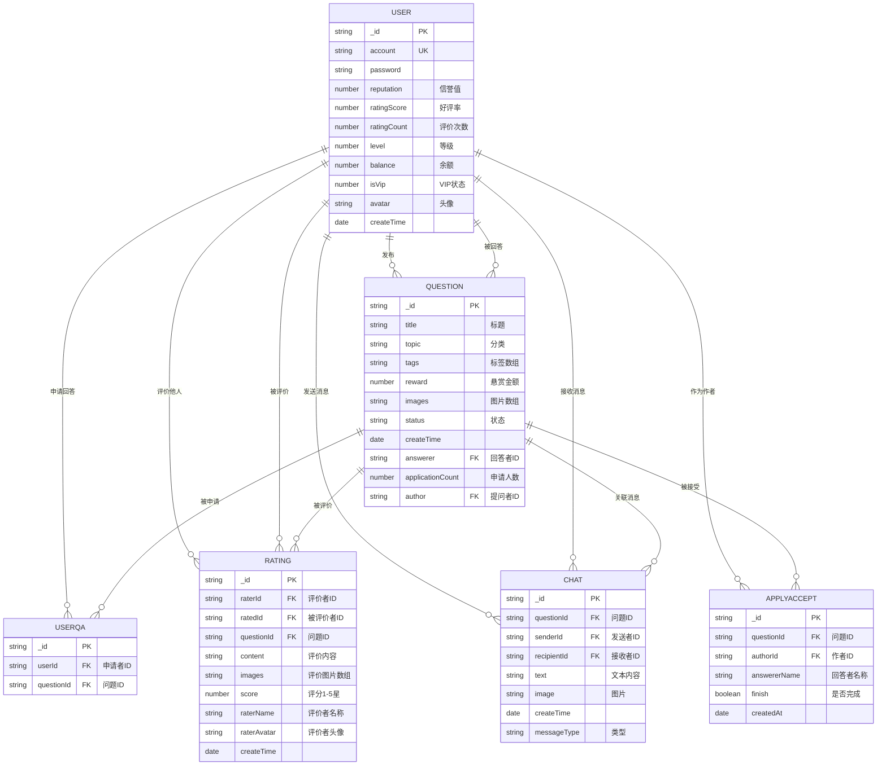

# 数据库模型关系图

## ER 图 (Mermaid)



## 模型关系说明

### 1. User (用户表)
- **主键**: `_id`
- **唯一索引**: `account` (账号)
- **关联关系**:
  - 一对多 → Question (作为提问者 author)
  - 一对多 → Question (作为回答者 answerer)
  - 一对多 → UserQA (申请回答问题)
  - 一对多 → Rating (作为评价者 raterId)
  - 一对多 → Rating (作为被评价者 ratedId)
  - 一对多 → Chat (作为发送者 senderId)
  - 一对多 → Chat (作为接收者 recipientId)
  - 一对多 → ApplyAccept (作为作者 authorId)

### 2. Question (问题表)
- **主键**: `_id`
- **外键**: 
  - `author` → User._id (提问者)
  - `answerer` → User._id (回答者，可为空)
- **关联关系**:
  - 多对一 → User (提问者)
  - 多对一 → User (回答者)
  - 一对多 → UserQA (申请记录)
  - 一对多 → Rating (评价记录)
  - 一对多 → Chat (聊天记录)
  - 一对多 → ApplyAccept (接受申请记录)

### 3. UserQA (用户-问题关联表)
- **主键**: `_id`
- **外键**:
  - `userId` → User._id (申请者)
  - `questionId` → Question._id (问题)
- **作用**: 记录用户申请回答某问题的关系

### 4. Rating (评价表)
- **主键**: `_id`
- **外键**:
  - `raterId` → User._id (评价者)
  - `ratedId` → User._id (被评价者)
  - `questionId` → Question._id (关联问题)
- **作用**: 双向评价系统，评价者和被评价者互相评价

### 5. Chat (聊天表)
- **主键**: `_id`
- **外键**:
  - `questionId` → Question._id (关联问题)
  - `senderId` → User._id (发送者)
  - `recipientId` → User._id (接收者)
- **索引**: `senderId`, `recipientId`
- **作用**: 问题相关的私聊消息

### 6. ApplyAccept (申请接受表)
- **主键**: `_id`
- **外键**:
  - `questionId` → Question._id (问题)
  - `authorId` → User._id (作者)
- **复合索引**: `{ authorId: 1, finish: 1 }`
- **作用**: 记录作者接受某个回答者申请的信息

## 业务流程关系

```
┌─────────────┐     发布      ┌─────────────┐
│    User     │──────────────→│  Question   │
│   (提问者)   │               │   (问题)    │
└─────────────┘               └──────┬──────┘
       │                             │
       │                             │ 被申请
       │                             ▼
       │                      ┌─────────────┐
       │                      │   UserQA    │
       │                      │  (申请记录)  │
       │                      └──────┬──────┘
       │                             │
       │ 接受申请                     │ 申请
       │◄────────────────────────────┤
       │                             │
       ▼                             ▼
┌─────────────┐               ┌─────────────┐
│ ApplyAccept │               │    User     │
│ (接受记录)   │               │   (回答者)   │
└─────────────┘               └──────┬──────┘
                                     │
              ┌──────────────────────┼──────────────────────┐
              │                      │                      │
              ▼                      ▼                      ▼
       ┌─────────────┐       ┌─────────────┐       ┌─────────────┐
       │    Chat     │       │   Rating    │       │   Rating    │
       │   (聊天)    │       │ (评价回答者) │       │ (评价提问者) │
       └─────────────┘       └─────────────┘       └─────────────┘
```

## 核心业务流程

1. **发布问题**: User → Question
2. **申请回答**: User → UserQA → Question
3. **接受申请**: Question作者 → ApplyAccept → 选定回答者
4. **开始聊天**: User (双方) → Chat (关联Question)
5. **完成评价**: 双方 → Rating (更新User评分数据)
